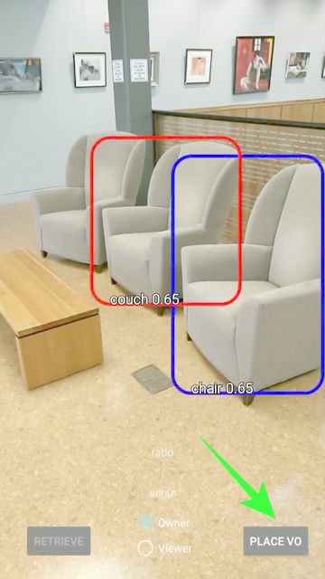
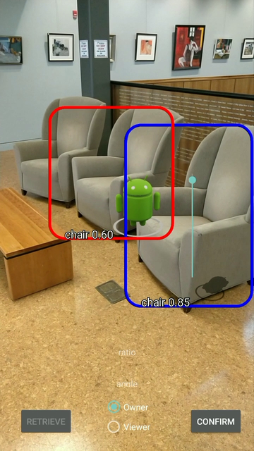
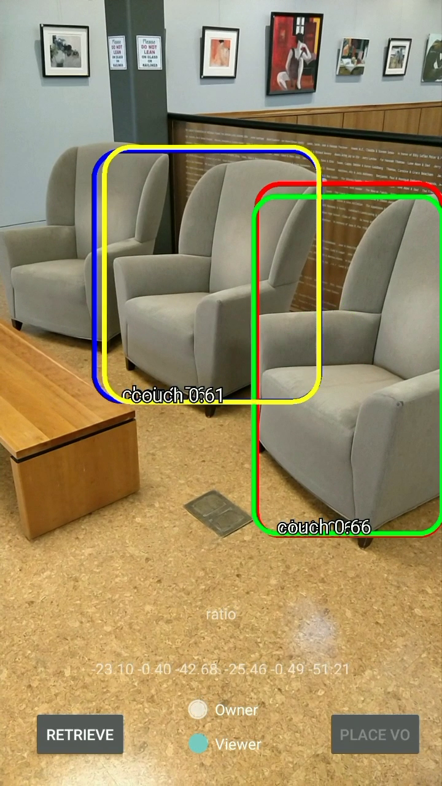
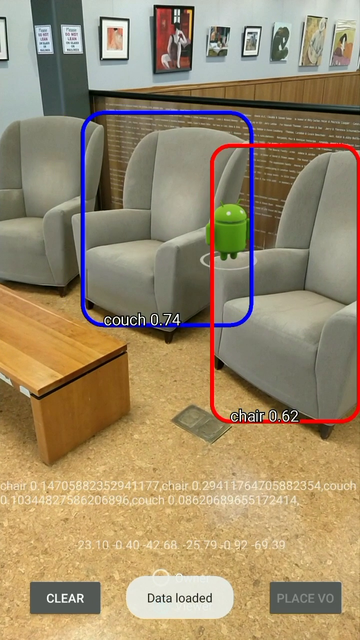

# PROMAR

This is an implementation of PROMAR on Android. PROMAR aims at providing multi-user AR applications on off-the-shelf smartphones without special hardware.

## Requirement

* SDK version 24 or higher
* JAVA 8 or higher

# Step by Step

Below are a series of basic processes in a complete workflow.

## 1. Find reference object and place virtual oject

When TensorFlow successfully recognizes objects, use them as references and press PLACE VO button to place virtual object. Use the bar on right of the screen to adjust virtual object distance.

## 2. Extract feature points and save data to local

After you feeling satisfied with the virtual object, press CONFIRM button. Take a breath, the application takes a few seconds to finish this process, but you will see that pays off.

## 3. Swith to Viewer mode and load data

After the virtual object owner finished cooking, now it's time to serve it to the viewer. Press the Viewer box at the bottom of screen to switch to viewer mode and click button RETRIEVE to load data. Hold tight, magic time!

## 4. Scan the reference object to retrieve the virtual object

When the message "Data loaded" toasts on screen, scan the reference object and say hello to your new/old friend.

